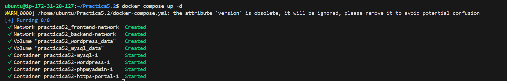
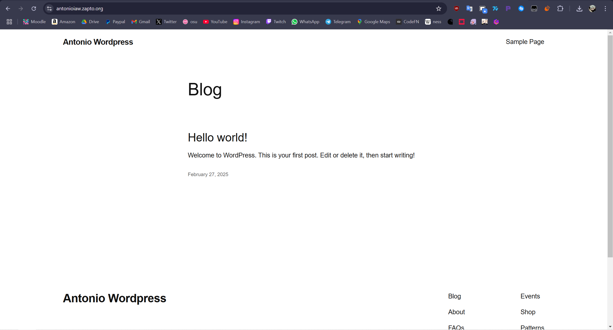
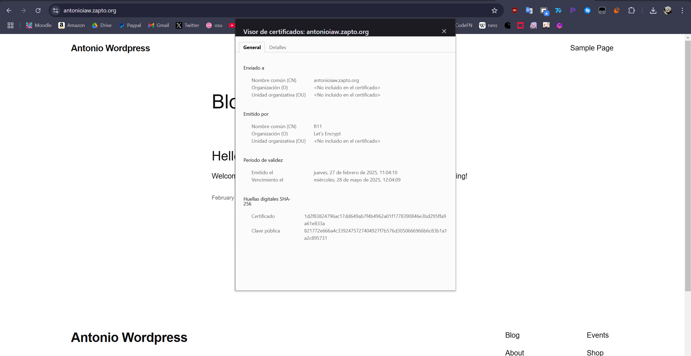
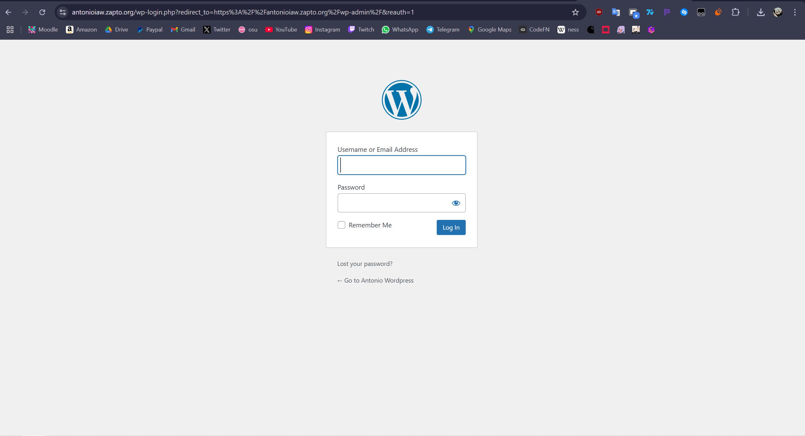
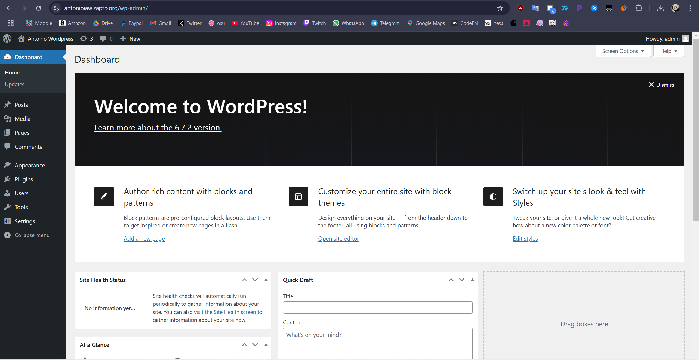

# Practica5.2 - Wordpress con Docker Compose

## Salida de ejecución de **docker compose ud -d**

## Página de Wordpress

## Certificado emitido por Let's Encrypt

## Pantalla de login de Wordpress

## Panel de administrador de Wordpress
